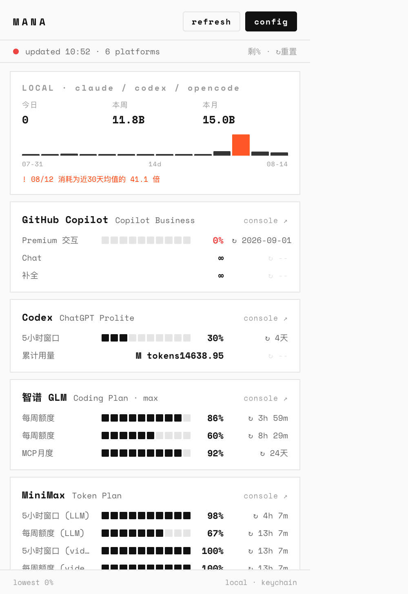

# Mana

> AI 额度的蓝条。macOS 菜单栏监控 10 家 AI 平台的剩余额度、重置倒计时与本地用量。



Mana 是一个纯本地的 macOS 菜单栏应用（Swift 壳 + 内置 Node 运行时，零外部依赖），终端风格界面，一眼看清"还剩多少、什么时候回血"。

## 特性

- **统一"剩余"语义** —— 所有进度一律显示还剩多少（不再是有的显示已用、有的显示剩余），每条额度都带 ↻ 重置倒计时
- **注意力模式菜单栏** —— 刘海屏空间有限，只有剩余低于阈值（默认 80%）的平台才常驻菜单栏，按紧急度排列、残血变红；健康的平台点开 popover 看
- **多轨道额度** —— 5h 窗口 / 周额度 / 月度积分分轨展示（Claude 时代的三池三时钟问题不存在了，我们直接显示每条轨）
- **阈值通知** —— 剩余不足时 macOS 系统通知（20%/10% 两档、余额绝对值阈值），跨阈值才触发不轰炸，右键可暂停 1 小时
- **本地用量趋势** —— 被动解析 `~/.claude`、`~/.codex`、opencode 本地数据，14 天 token 趋势 + 异常日标记（无任何成本数字）
- **多 Key 管理** —— 每个平台可挂多个 API Key，逐 Key 展开显示；Key 全部存 macOS Keychain，不落盘
- **CLI** —— `mana usage --json` / `summary` / `local`，供 statusline / 脚本消费
- **隐私** —— 纯本地运行，无遥测；API Key 存 Keychain；只在你点击时访问平台 API

## 支持平台

| 平台 | 类型 | 数据 |
|------|------|------|
| 智谱 GLM (BigModel) | API Key | 5h/周额度 + MCP 月度 |
| MiniMax | API Key | 5h/周额度（LLM + video） |
| Kimi For Coding | API Key | 窗口额度 + 每周总额 |
| Moonshot | API Key | 余额（国内/国际双区自动重试） |
| DeepSeek | API Key | 余额 |
| 硅基流动 SiliconFlow | API Key | 余额 |
| OpenRouter | API Key | Credits 余额 |
| Grok (xAI) | API Key | Credits 余额 |
| GitHub Copilot | OAuth 设备流 | Premium 额度 + Chat/补全 |
| Codex | 本地 `~/.codex` | 5h/周窗口 + 累计 token |

## 安装

**要求**：Apple Silicon Mac（M1/M2/M3/M4）· macOS 13+

1. 从 [Releases](../../releases) 下载 `Mana.dmg`
2. 打开 DMG，把 Mana 拖入 Applications
3. 首次打开：**右键 Mana → 打开 → 再点"打开"**（当前使用开发调试证书且未公证，仍可能需要手动放行一次）
4. 菜单栏点开 → `config` 添加各平台 API Key（Key 存在本机 Keychain）

> 从 TokenLens 升级：Keychain 里的 Key 会在首次启动时自动迁移，无需重配。

## 使用

- **菜单栏**：`Codex 30%` 这类条目 = 该平台最紧张的额度剩余；红色 = 残血
- **popover**：全平台明细 + LOCAL 本地用量卡；每张卡的 `console ↗` 直达平台控制台
- **设置**：通知阈值 / 菜单栏模式与阈值 / API Key 管理 / GitHub 授权
- **右键菜单栏**：暂停通知 1 小时 / 退出

### CLI

```bash
npm install -g .   # 或 npm link
mana usage         # 全平台剩余（终端表格，CJK 对齐）
mana summary       # 单行：最低剩余 + 平台数
mana usage --json  # JSON 输出
```

## 开发

```bash
npm install
npm test                  # 28 tests
bash src-swift/build.sh   # 本机构建（含个人配置）
DIST=1 bash src-swift/build.sh   # 干净分发构建
```

构建会优先使用本机的 `Developer ID Application`，其次使用 `Apple Development`，都没有时才退回 ad-hoc；也可通过 `SIGN_IDENTITY` 显式指定。只有 `Developer ID Application` 配合苹果公证，才能获得完整的外部分发体验。

架构与约定见 [AGENTS.md](AGENTS.md)。核心不变量：剩余语义三端同步（`services/remaining.js` / `popover.html` / `main.swift`）；界面不出现成本金额；菜单栏保持紧凑（刘海会吞溢出项）。

## License

MIT
